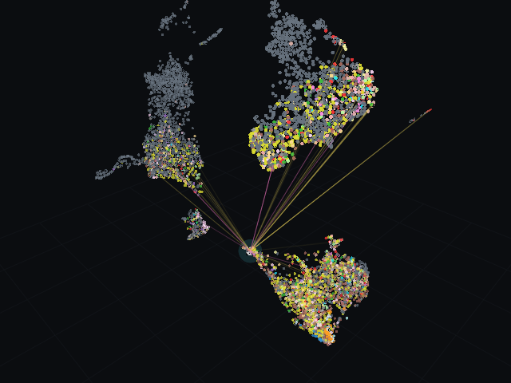
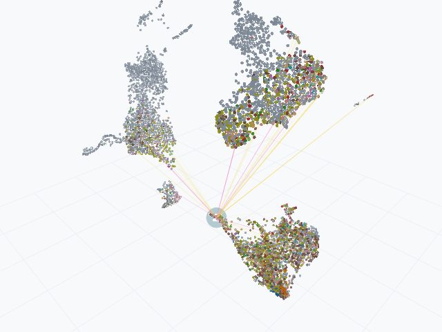
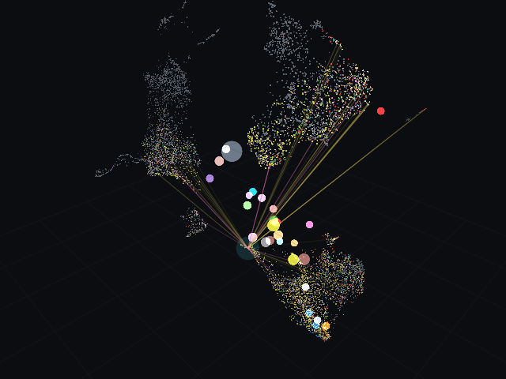
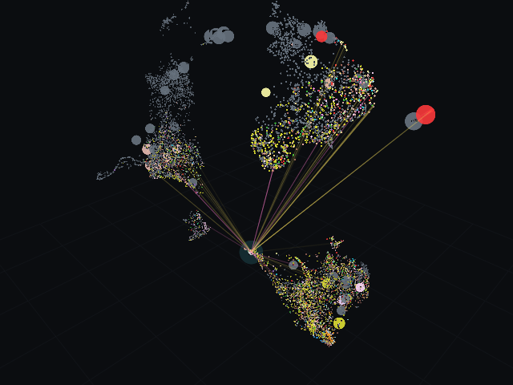

# starplast

A 3D browser for the *Toxoplasma gondii* knowledge map. 8,140 genes are points in space, twelve kinds of
relation are toggleable edges, and clicking a gene shows everything that is actually known about it —
including when the answer is "nothing".

The single idea it is built around: **most of this proteome has never been studied, and a tool that does
not say so will mislead you.** 5,574 of 8,140 genes are named in no paper at all, and of those that are
named, most appear only in a screen's hit table rather than in any title or abstract. So the interface
distinguishes measurement from inference from absence everywhere, and never lets one read as another.

Why the map is a UMAP rather than a force-directed layout, how attention correction works, and every
other design decision: **[HANDOFF.md](HANDOFF.md)**. Methods prose for publication:
**[MATERIALS_AND_METHODS.md](MATERIALS_AND_METHODS.md)**.

## Install and run

```bash
pip install -e .
starplast
```

Needs a display and OpenGL. Nothing else: the built cache ships inside the package, so the application
runs offline, with no dataset, no configuration and no build step.

Rebuilding the cache from the published sources is a separate job and needs the raw data:

```bash
python -m starplast.paths            # where data is being resolved from, and what is missing
python -m starplast.fetch_names      # one-off: ToxoDB symbols, previous and strain accessions
python -m starplast.build_graph      # ~5 min; writes the cache
pytest tests/ -q                     # headless, no network
```

If a file cannot be found, `python -m starplast.paths` prints which locations were searched and which
datasets are absent. Two environment variables override the search:

| variable | what it points at |
|---|---|
| `STARPLAST_CACHE` | the built cache the application reads |
| `STARPLAST_DATA` | the raw published datasets, needed only to rebuild |

The one deliberate exception to running offline is **structure coordinates**. AlphaFold models and
crosslink complexes are gigabytes, so they are fetched when you click a gene and cached under
`~/.cache/starplast`. Everything needed to *decide* something is already on disk; only the picture is
downloaded.

## API reference

Every module's docstring carries the reasoning behind it, not just its signature, so the generated
reference is genuinely the documentation. Build it locally with:

```bash
pip install pdoc
python -m pdoc --output-directory docs/api --no-search --docformat markdown starplast
```

It is rebuilt and published on every push to `main`; it is never committed, because a checked-in copy
drifts from the docstrings it came from.

## What you see

| dark | light |
|---|---|
|  |  |

A gene is selected in both: the halo marks it, and its edges fan out to the genes it is related to.
Grey is *unknown*, never a category and never zero — 5,574 genes are named in no paper at all.

The level of detail follows the data rather than invented tiers. Compartment centroids, orthogroup
centroids, then genes:

| compartment | orthogroup | gene |
|---|---|---|
|  |  |  |

| | |
|---|---|
| left-drag / scroll | rotate / zoom |
| left-click a gene | select it; fills the evidence panel |
| search box | gene ID or product text, then flies to it |
| double-click a compartment | fly to that compartment's centroid |
| level of detail | compartment → orthogroup → gene |
| edge checkboxes | per relation type; edges draw for the selected gene unless "draw all" is on |
| Preferences | theme, colour map, point style, rendering, depth cueing, horizon grid |

## Datasets included

Every dataset the map is built from, with what it measures and where it came from. This table is
generated from `starplast.datasets.REGISTRY`; a test fails if it drifts from the registry.

### DNA — genetic perturbation and DNA-level readouts

| Dataset | Type of data | Coverage | Reference |
|---|---|---|---|
| GRA12 strains and mouse subspecies | Median L2FC in vitro and in vivo, DISCO score; two screens | 236 / 232 | GRA12 is a common virulence factor across Toxoplasma gondii strains and mouse subspecies; PMID [40240328](https://pubmed.ncbi.nlm.nih.gov/40240328/) |
| GRA17 synthetic-lethal screen | RH and RH-delta-gra17 phenotype by passage; MAGeCK p-values | 7,553 (genome-wide) | Genome-wide CRISPR screen identifies genes synthetically lethal with GRA17, a nutrient channel encoding gene in Toxoplasma; PMID [37498952](https://pubmed.ncbi.nlm.nih.gov/37498952/) |
| Host-transcription effector screen | Hotelling T2 statistic per effector, adjusted p | 252 | High-throughput identification of Toxoplasma gondii effector proteins that target host cell transcription; PMID [37827122](https://pubmed.ncbi.nlm.nih.gov/37827122/) |
| In vitro CRISPR fitness (HFF) | Competitive growth in fibroblasts | 7,325 (90.0%) | A Genome-wide CRISPR Screen in Toxoplasma Identifies Essential Apicomplexan Genes (Sidik et al. 2016); PMID [27594426](https://pubmed.ncbi.nlm.nih.gov/27594426/) |
| In vivo CRISPR composite scores | Peritoneum, lung, liver, spleen composite scores | 7,395 (90.8%) | PMID [31481656](https://pubmed.ncbi.nlm.nih.gov/31481656/); `ToxoDB tgonGt1CrisprFunc*` |
| In vivo CRISPR platform | Mean log fold-change across replicates | 168 | A CRISPR platform for targeted in vivo screens identifies Toxoplasma gondii virulence factors in mice; PMID [31481656](https://pubmed.ncbi.nlm.nih.gov/31481656/) |
| Macrophage CRISPR screens | Naive BMDM and IFN-gamma survival | 7,402 (90.9%) | Forward genetics screens using macrophages to identify Toxoplasma gondii genes important for resistance to IFN-gamma (2015) -- CONFIRM this is the source; PMID [25867017](https://pubmed.ncbi.nlm.nih.gov/25867017/) |
| Young 2019 in vivo screen | In vivo fitness | 115 | *citation not yet confirmed* |

### Transcription — RNA abundance

| Dataset | Type of data | Coverage | Reference |
|---|---|---|---|
| Life-cycle stage enrichment (DERIVED) | Which stage a gene's own expression is highest in | 1,911 of 8,140 genes called | *citation not yet confirmed* |
| Oocyst sporulation series | Unsporulated / sporulating / sporulated, 2 replicates (6 columns) | 7,974 (98.0%) | `GSE206344` |
| Single-parasite transcriptional atlas (cell cycle) | Measured cell-cycle phase per gene, and pseudotime cluster | 873 genes phased, 7,499 clustered | Xue Y et al. eLife 2020;9:e54129; PMID [32065584](https://pubmed.ncbi.nlm.nih.gov/32065584/) |
| Stage transcriptome | Tachyzoite, day 3/5/7, in vivo tissue cyst (12 columns) | 7,739 (95.1%) | `GSE108740` |

### Translation — protein abundance

| Dataset | Type of data | Coverage | Reference |
|---|---|---|---|
| Pru proteome and IP abundance | Median log2 iBAQ across replicates | 748 (9.2%) | `PXD043808, PXD065585` |

### Post-translation — properties of the folded protein

| Dataset | Type of data | Coverage | Reference |
|---|---|---|---|
| C. parvum hyperLOPIT | Donor labels for orthoLOPIT transfer | 1,107 usable | Guerin et al. 2023 |
| Foldseek structural similarity | TM-align over Toxoplasma AlphaFold models, TM >= 0.7 | 11,684 pairs / 2,338 genes | *citation not yet confirmed* |
| IP-MS of tagged baits | Replicated pulldown vs untagged control | 64 pairs / 48 genes | `PXD043808, PXD065585` |
| P. falciparum LOPIT | Donor labels for orthoLOPIT transfer | 1,646 usable | *citation not yet confirmed* |
| Phosphosite counts | Count of phosphosites per protein, no positions | 1,175 (14.4%) | *citation not yet confirmed* |
| Proximity-labelling corpus | 42 BioID/TurboID/APEX studies with a tagged Toxoplasma protein | 28 studies with data, 127 files | *citation not yet confirmed* |
| Pulldown corpus | 55 IP-MS / co-IP studies with a tagged Toxoplasma protein | 29 studies with data, 140 files | *citation not yet confirmed* |
| StarPath crosslink MS | Measured physical proximity; residue-level crosslinks and Chai-1 complexes | 2,842 pairs / 1,630 genes | Mapping a Toxoplasma gondii interactome by crosslinking mass spectrometry and machine learning (2025); PMID [40874616](https://pubmed.ncbi.nlm.nih.gov/40874616/) |
| T. gondii hyperLOPIT | Subcellular compartment, MAP and MCMC, with posteriors | 3,827 (47.0%) | A Comprehensive Subcellular Atlas of the Toxoplasma Proteome via hyperLOPIT (Barylyuk et al. 2020); PMID [33053376](https://pubmed.ncbi.nlm.nih.gov/33053376/) |

### Reference — not a study result

| Dataset | Type of data | Coverage | Reference |
|---|---|---|---|
| AlphaFold DB | Per-gene mean pLDDT; coordinates fetched on demand | 6,480 (79.6%) | Jumper et al. 2021, AlphaFold Protein Structure Database; `AlphaFold DB` |
| InterPro domains | Domain identity and count | 8,140 | *citation not yet confirmed* |
| OrthoMCL orthogroups | Orthogroup assignment and cross-species bridge | 16,793 groups | `OrthoMCL` |
| PubMed Central open-access full texts | Sectioned JATS XML | 6,667 articles | *citation not yet confirmed* |
| PubMed abstracts | Titles and abstracts for co-mention and attention | 33,924 records | *citation not yet confirmed* |
| ToxoDB gene identity | Symbols, previous IDs, product descriptions | 8,843 ME49 genes | `ToxoDB ME49` |

Where a citation is not yet confirmed the table says so rather than leaving a blank —
`starplast.datasets.unresolved()` lists those, so an unverified reference cannot reach a manuscript
unnoticed.

## Licence and citing

Cite the original studies, not this table. The repository redistributes derived facts and the identity
tables, never the source articles' files.
