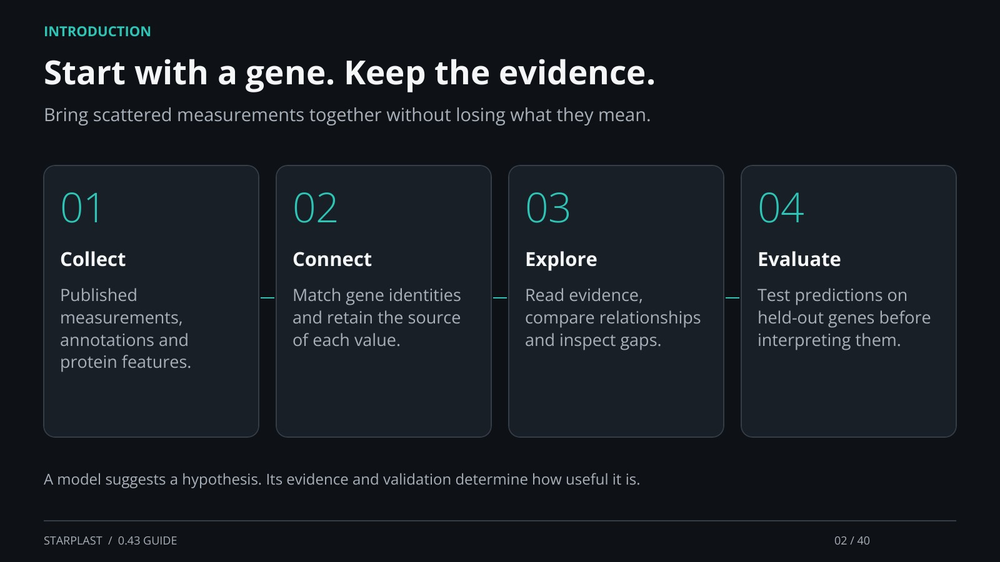

[← Back](01.md) · 2 / 40 · [Next →](03.md)

## Start with a gene. Keep the evidence.

Bring scattered measurements together without losing what they mean.

Collect: Published measurements, annotations and protein features.

Connect: Match gene identities and retain the source of each value.

Explore: Read evidence, compare relationships and inspect gaps.

Evaluate: Test predictions on held-out genes before interpreting them.

A model suggests a hypothesis. Its evidence and validation determine how useful it is.

[Supporting documentation](https://einarolafsson.github.io/starplast/guide.html)
