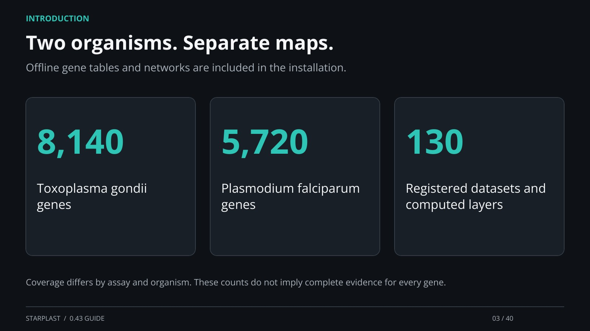

[← Back](02.md) · 3 / 40 · [Next →](04.md)

## Two organisms. Separate maps.

Offline gene tables and networks are included in the installation.

8,140: Toxoplasma gondii genes

5,720: Plasmodium falciparum genes

130: Registered datasets and computed layers

Coverage differs by assay and organism. These counts do not imply complete evidence for every gene.

[Supporting documentation](https://einarolafsson.github.io/starplast/datasets.html)
