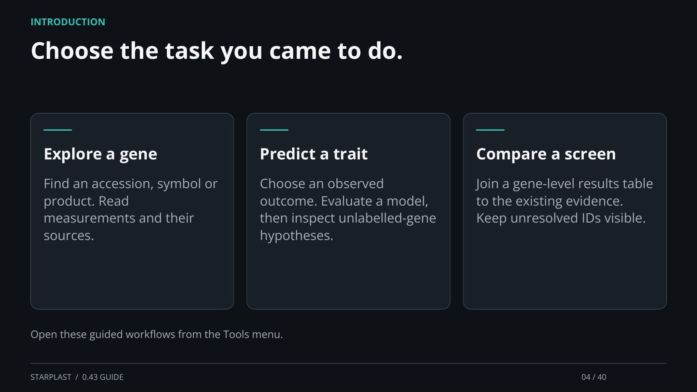

[← Back](03.md) · 4 / 40 · [Next →](05.md)

## Choose the task you came to do.

Explore a gene: Find an accession, symbol or product. Read measurements and their sources.

Predict a trait: Choose an observed outcome. Evaluate a model, then inspect unlabelled-gene hypotheses.

Compare a screen: Join a gene-level results table to the existing evidence. Keep unresolved IDs visible.

Open these guided workflows from the Tools menu.

[Supporting documentation](https://einarolafsson.github.io/starplast/workflows.html)
