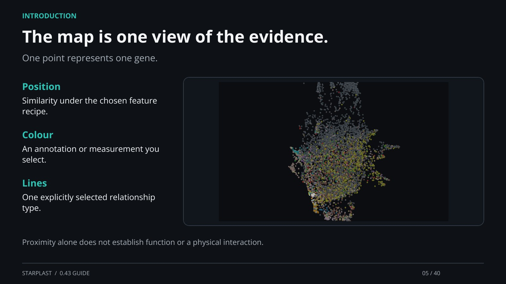

[← Back](04.md) · 5 / 40 · [Next →](06.md)

## The map is one view of the evidence.

One point represents one gene.

Position: Similarity under the chosen feature recipe.

Colour: An annotation or measurement you select.

Lines: One explicitly selected relationship type.

Proximity alone does not establish function or a physical interaction.

[Supporting documentation](https://einarolafsson.github.io/starplast/guide.html)
