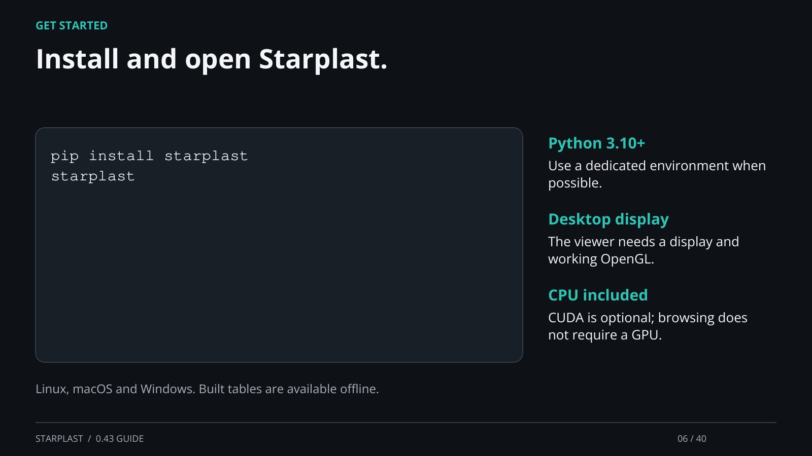

[← Back](05.md) · 6 / 40 · [Next →](07.md)

## Install and open Starplast.

pip install starplast
starplast

Python 3.10+: Use a dedicated environment when possible.

Desktop display: The viewer needs a display and working OpenGL.

CPU included: CUDA is optional; browsing does not require a GPU.

Linux, macOS and Windows. Built tables are available offline.

[Supporting documentation](https://einarolafsson.github.io/starplast/releases.html)
