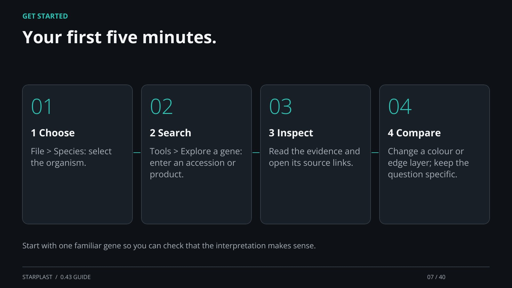

[← Back](06.md) · 7 / 40 · [Next →](08.md)

## Your first five minutes.

1  Choose: File > Species: select the organism.

2  Search: Tools > Explore a gene: enter an accession or product.

3  Inspect: Read the evidence and open its source links.

4  Compare: Change a colour or edge layer; keep the question specific.

Start with one familiar gene so you can check that the interpretation makes sense.

[Supporting documentation](https://einarolafsson.github.io/starplast/guide.html)
