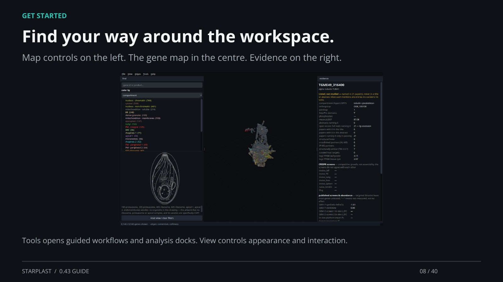

[← Back](07.md) · 8 / 40 · [Next →](09.md)

## Find your way around the workspace.

Map controls on the left. The gene map in the centre. Evidence on the right.

Tools opens guided workflows and analysis docks. View controls appearance and interaction.

[Supporting documentation](https://einarolafsson.github.io/starplast/guide.html)
