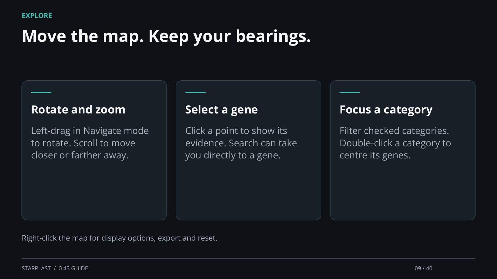

[← Back](08.md) · 9 / 40 · [Next →](10.md)

## Move the map. Keep your bearings.

Rotate and zoom: Left-drag in Navigate mode to rotate. Scroll to move closer or farther away.

Select a gene: Click a point to show its evidence. Search can take you directly to a gene.

Focus a category: Filter checked categories. Double-click a category to centre its genes.

Right-click the map for display options, export and reset.

[Supporting documentation](https://einarolafsson.github.io/starplast/guide.html)
