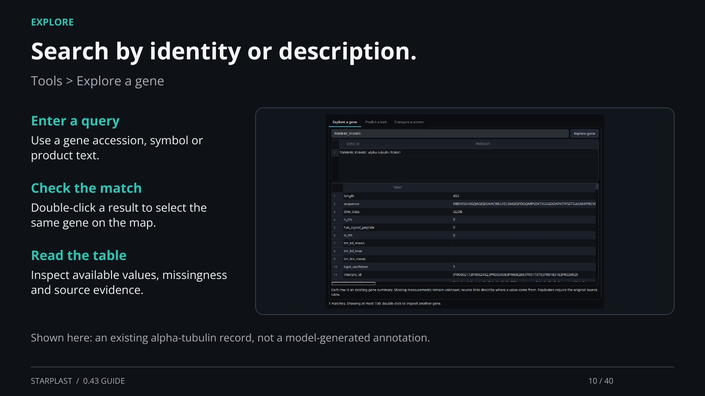

[← Back](09.md) · 10 / 40 · [Next →](11.md)

## Search by identity or description.

Tools > Explore a gene

Enter a query: Use a gene accession, symbol or product text.

Check the match: Double-click a result to select the same gene on the map.

Read the table: Inspect available values, missingness and source evidence.

Shown here: an existing alpha-tubulin record, not a model-generated annotation.

[Supporting documentation](https://einarolafsson.github.io/starplast/workflows.html)
