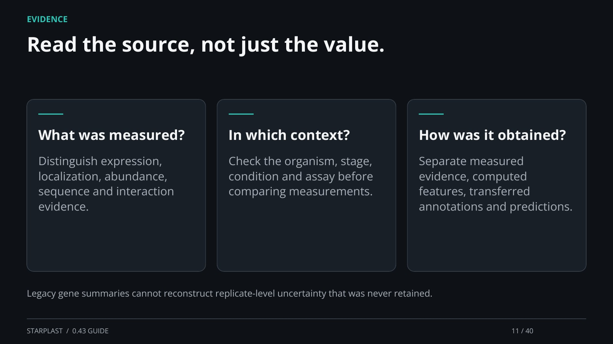

[← Back](10.md) · 11 / 40 · [Next →](12.md)

## Read the source, not just the value.

What was measured?: Distinguish expression, localization, abundance, sequence and interaction evidence.

In which context?: Check the organism, stage, condition and assay before comparing measurements.

How was it obtained?: Separate measured evidence, computed features, transferred annotations and predictions.

Legacy gene summaries cannot reconstruct replicate-level uncertainty that was never retained.

[Supporting documentation](https://einarolafsson.github.io/starplast/workflows.html)
