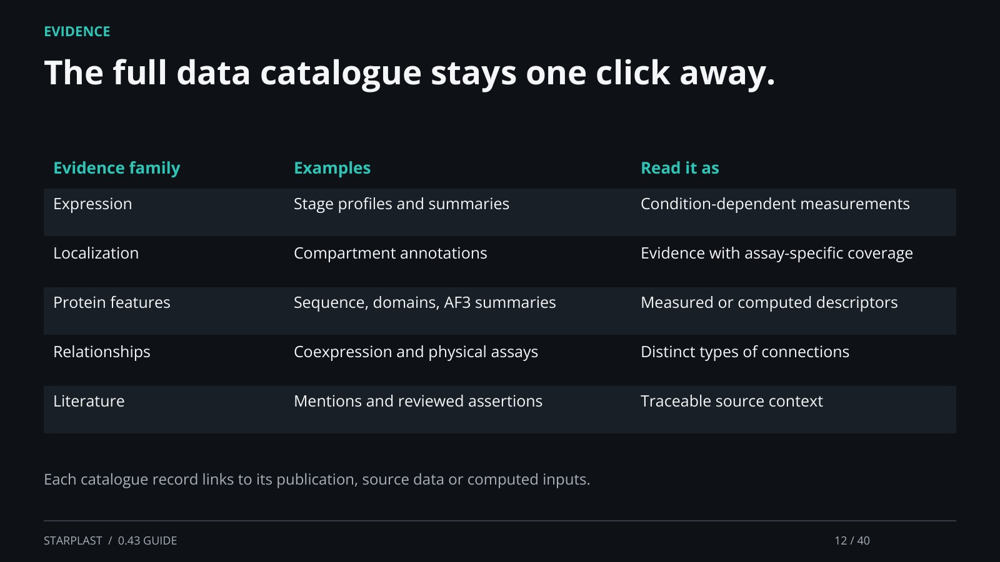

[← Back](11.md) · 12 / 40 · [Next →](13.md)

## The full data catalogue stays one click away.

Evidence family | Examples | Read it as

Expression | Stage profiles and summaries | Condition-dependent measurements

Localization | Compartment annotations | Evidence with assay-specific coverage

Protein features | Sequence, domains, AF3 summaries | Measured or computed descriptors

Relationships | Coexpression and physical assays | Distinct types of connections

Literature | Mentions and reviewed assertions | Traceable source context

Each catalogue record links to its publication, source data or computed inputs.

[Supporting documentation](https://einarolafsson.github.io/starplast/datasets.html)
