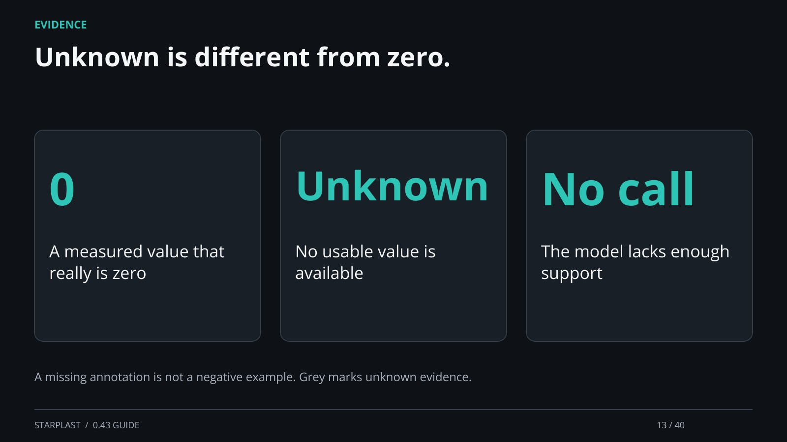

[← Back](12.md) · 13 / 40 · [Next →](14.md)

## Unknown is different from zero.

0: A measured value that really is zero

Unknown: No usable value is available

No call: The model lacks enough support

A missing annotation is not a negative example. Grey marks unknown evidence.

[Supporting documentation](https://einarolafsson.github.io/starplast/workflows.html)
