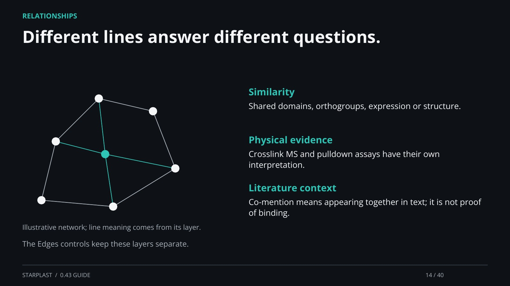

[← Back](13.md) · 14 / 40 · [Next →](15.md)

## Different lines answer different questions.

Similarity: Shared domains, orthogroups, expression or structure.

Physical evidence: Crosslink MS and pulldown assays have their own interpretation.

Literature context: Co-mention means appearing together in text; it is not proof of binding.

The Edges controls keep these layers separate.

[Supporting documentation](https://einarolafsson.github.io/starplast/guide.html)
