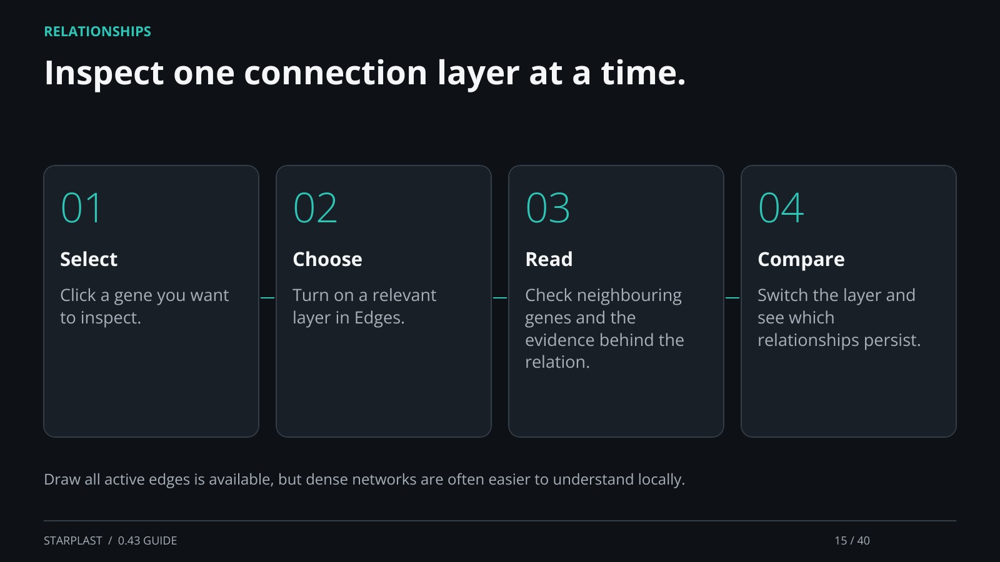

[← Back](14.md) · 15 / 40 · [Next →](16.md)

## Inspect one connection layer at a time.

Select: Click a gene you want to inspect.

Choose: Turn on a relevant layer in Edges.

Read: Check neighbouring genes and the evidence behind the relation.

Compare: Switch the layer and see which relationships persist.

Draw all active edges is available, but dense networks are often easier to understand locally.

[Supporting documentation](https://einarolafsson.github.io/starplast/guide.html)
