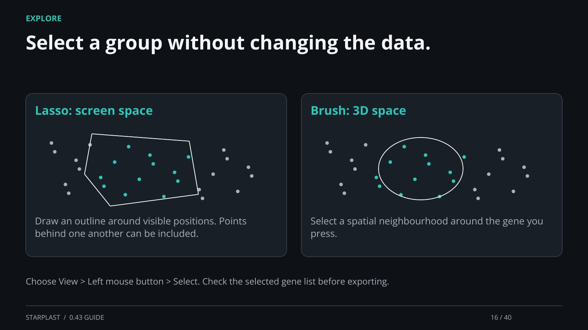

[← Back](15.md) · 16 / 40 · [Next →](17.md)

## Select a group without changing the data.

Lasso: screen space: Draw an outline around visible positions. Points behind one another can be included.

Brush: 3D space: Select a spatial neighbourhood around the gene you press.

Choose View > Left mouse button > Select. Check the selected gene list before exporting.

[Supporting documentation](https://einarolafsson.github.io/starplast/guide.html)
