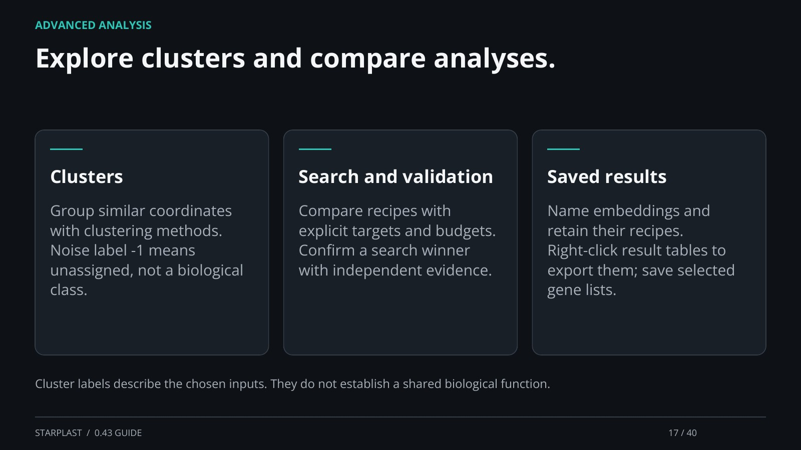

[← Back](16.md) · 17 / 40 · [Next →](18.md)

## Explore clusters and compare analyses.

Clusters: Group similar coordinates with clustering methods. Noise label -1 means unassigned, not a biological class.

Search and validation: Compare recipes with explicit targets and budgets. Confirm a search winner with independent evidence.

Saved results: Name embeddings and retain their recipes. Right-click result tables to export them; save selected gene lists.

Cluster labels describe the chosen inputs. They do not establish a shared biological function.

[Supporting documentation](https://einarolafsson.github.io/starplast/guide.html)
