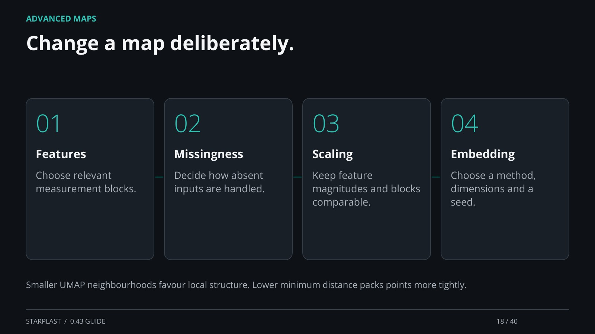

[← Back](17.md) · 18 / 40 · [Next →](19.md)

## Change a map deliberately.

Features: Choose relevant measurement blocks.

Missingness: Decide how absent inputs are handled.

Scaling: Keep feature magnitudes and blocks comparable.

Embedding: Choose a method, dimensions and a seed.

Smaller UMAP neighbourhoods favour local structure. Lower minimum distance packs points more tightly.

[Supporting documentation](https://einarolafsson.github.io/starplast/guide.html)
