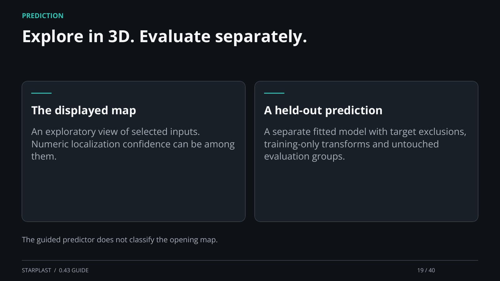

[← Back](18.md) · 19 / 40 · [Next →](20.md)

## Explore in 3D. Evaluate separately.

The displayed map: An exploratory view of selected inputs. Numeric localization confidence can be among them.

A held-out prediction: A separate fitted model with target exclusions, training-only transforms and untouched evaluation groups.

The guided predictor does not classify the opening map.

[Supporting documentation](https://einarolafsson.github.io/starplast/workflows.html)
