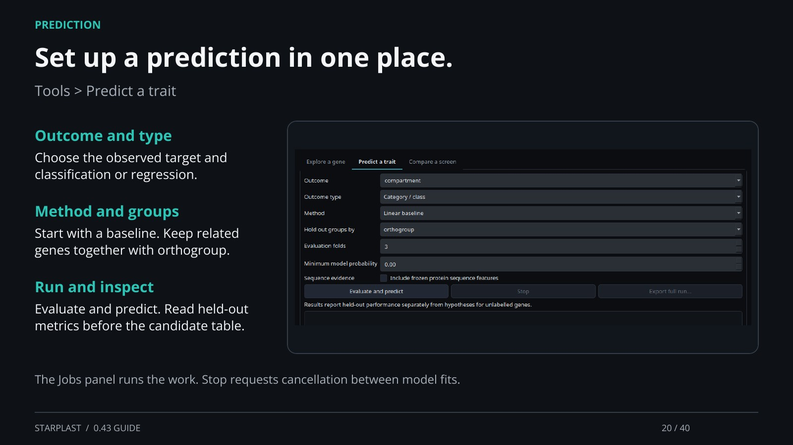

[← Back](19.md) · 20 / 40 · [Next →](21.md)

## Set up a prediction in one place.

Tools > Predict a trait

Outcome and type: Choose the observed target and classification or regression.

Method and groups: Start with a baseline. Keep related genes together with orthogroup.

Run and inspect: Evaluate and predict. Read held-out metrics before the candidate table.

The Jobs panel runs the work. Stop requests cancellation between model fits.

[Supporting documentation](https://einarolafsson.github.io/starplast/workflows.html)
