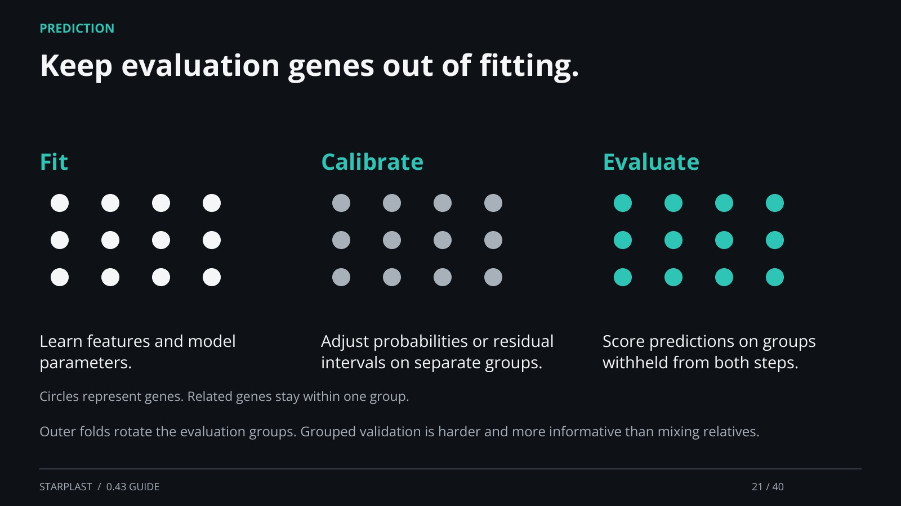

[← Back](20.md) · 21 / 40 · [Next →](22.md)

## Keep evaluation genes out of fitting.

Fit: Learn features and model parameters.

Calibrate: Adjust probabilities or residual intervals on separate groups.

Evaluate: Score predictions on groups withheld from both steps.

Outer folds rotate the evaluation groups. Grouped validation is harder and more informative than mixing relatives.

[Supporting documentation](https://einarolafsson.github.io/starplast/benchmark-0.43.html)
