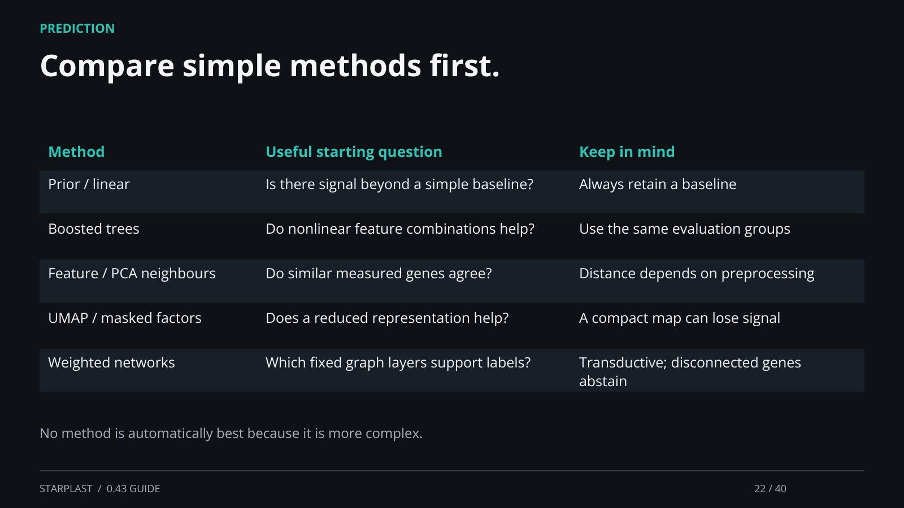

[← Back](21.md) · 22 / 40 · [Next →](23.md)

## Compare simple methods first.

Method | Useful starting question | Keep in mind

Prior / linear | Is there signal beyond a simple baseline? | Always retain a baseline

Boosted trees | Do nonlinear feature combinations help? | Use the same evaluation groups

Feature / PCA neighbours | Do similar measured genes agree? | Distance depends on preprocessing

UMAP / masked factors | Does a reduced representation help? | A compact map can lose signal

Weighted networks | Which fixed graph layers support labels? | Transductive; disconnected genes abstain

No method is automatically best because it is more complex.

[Supporting documentation](https://einarolafsson.github.io/starplast/workflows.html)
