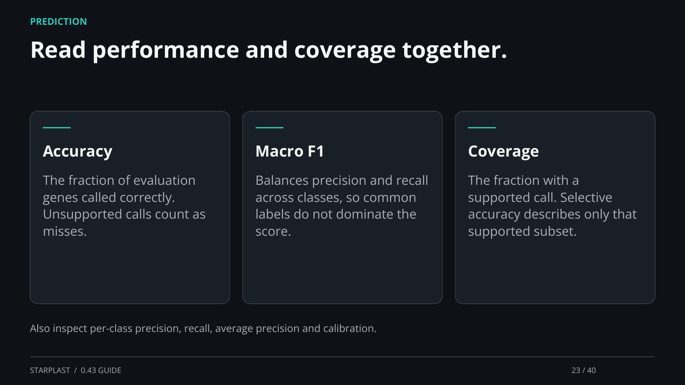

[← Back](22.md) · 23 / 40 · [Next →](24.md)

## Read performance and coverage together.

Accuracy: The fraction of evaluation genes called correctly. Unsupported calls count as misses.

Macro F1: Balances precision and recall across classes, so common labels do not dominate the score.

Coverage: The fraction with a supported call. Selective accuracy describes only that supported subset.

Also inspect per-class precision, recall, average precision and calibration.

[Supporting documentation](https://einarolafsson.github.io/starplast/workflows.html)
