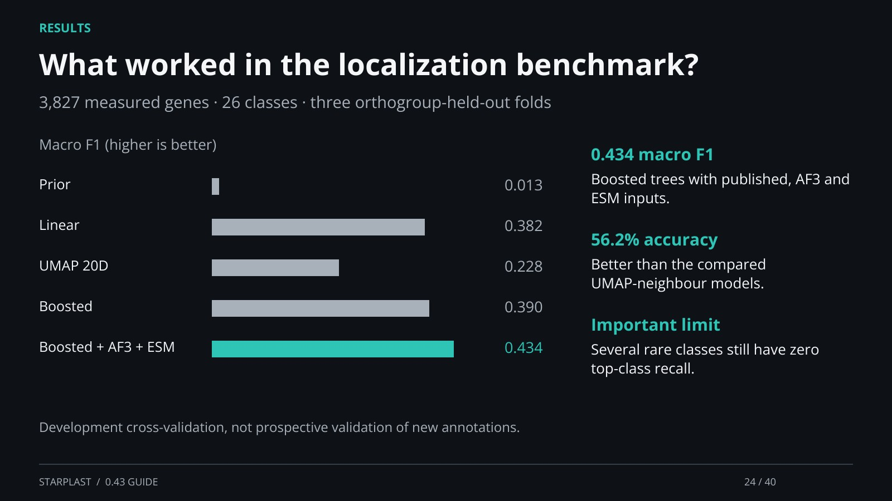

[← Back](23.md) · 24 / 40 · [Next →](25.md)

## What worked in the localization benchmark?

3,827 measured genes · 26 classes · three orthogroup-held-out folds

0.434 macro F1: Boosted trees with published, AF3 and ESM inputs.

56.2% accuracy: Better than the compared UMAP-neighbour models.

Important limit: Several rare classes still have zero top-class recall.

Development cross-validation, not prospective validation of new annotations.

[Supporting documentation](https://einarolafsson.github.io/starplast/benchmark-0.43.html)
