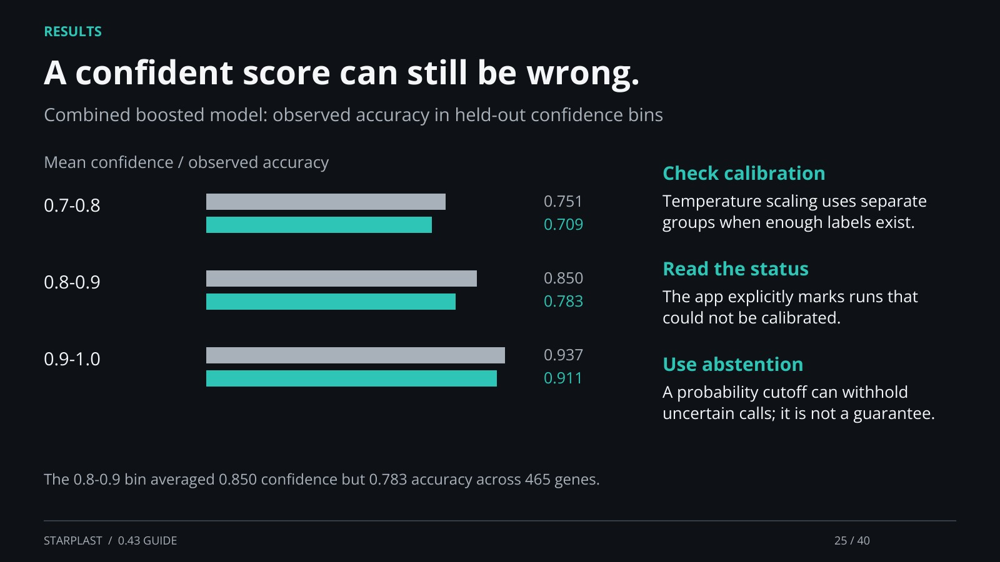

[← Back](24.md) · 25 / 40 · [Next →](26.md)

## A confident score can still be wrong.

Combined boosted model: observed accuracy in held-out confidence bins

Check calibration: Temperature scaling uses separate groups when enough labels exist.

Read the status: The app explicitly marks runs that could not be calibrated.

Use abstention: A probability cutoff can withhold uncertain calls; it is not a guarantee.

The 0.8-0.9 bin averaged 0.850 confidence but 0.783 accuracy across 465 genes.

[Supporting documentation](https://einarolafsson.github.io/starplast/benchmark-0.43.html)
