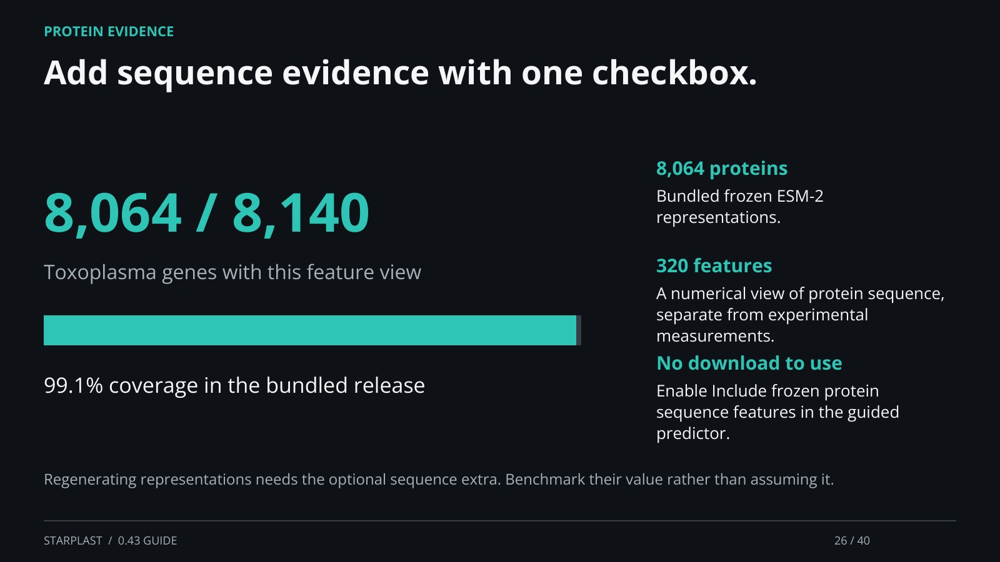

[← Back](25.md) · 26 / 40 · [Next →](27.md)

## Add sequence evidence with one checkbox.

8,064 proteins: Bundled frozen ESM-2 representations.

320 features: A numerical view of protein sequence, separate from experimental measurements.

No download to use: Enable Include frozen protein sequence features in the guided predictor.

Regenerating representations needs the optional sequence extra. Benchmark their value rather than assuming it.

[Supporting documentation](https://einarolafsson.github.io/starplast/protein-sequences.html)
