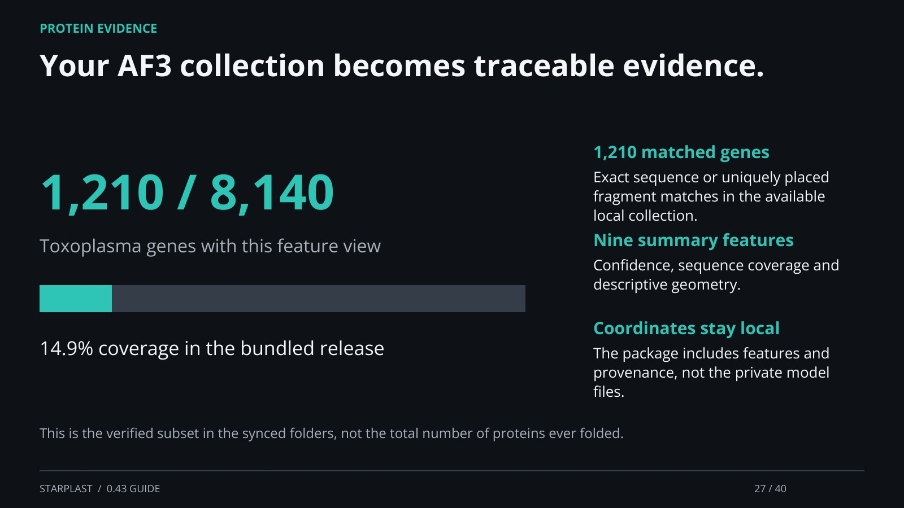

[← Back](26.md) · 27 / 40 · [Next →](28.md)

## Your AF3 collection becomes traceable evidence.

1,210 matched genes: Exact sequence or uniquely placed fragment matches in the available local collection.

Nine summary features: Confidence, sequence coverage and descriptive geometry.

Coordinates stay local: The package includes features and provenance, not the private model files.

This is the verified subset in the synced folders, not the total number of proteins ever folded.

[Supporting documentation](https://einarolafsson.github.io/starplast/structures.html)
