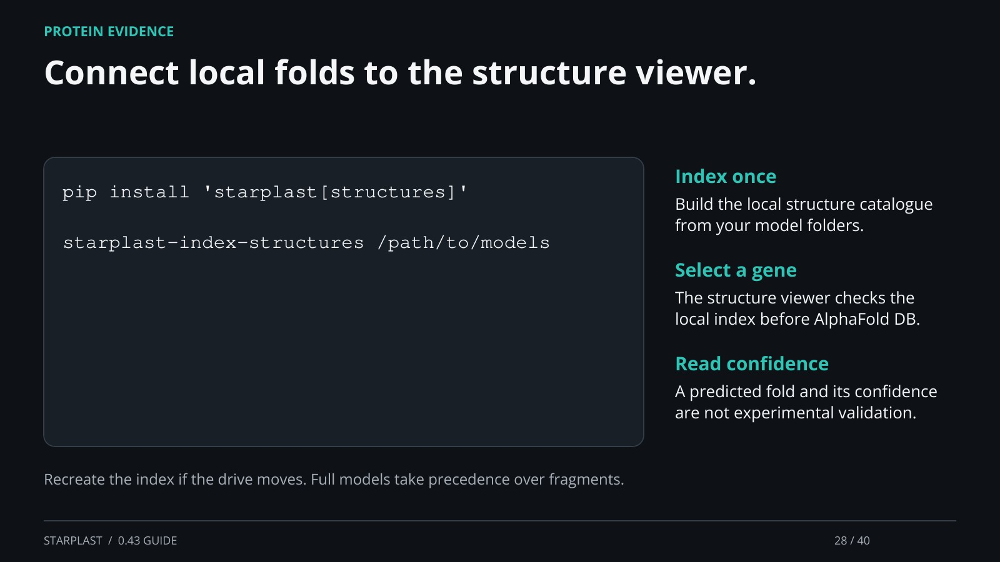

[← Back](27.md) · 28 / 40 · [Next →](29.md)

## Connect local folds to the structure viewer.

pip install 'starplast[structures]'

starplast-index-structures /path/to/models

Index once: Build the local structure catalogue from your model folders.

Select a gene: The structure viewer checks the local index before AlphaFold DB.

Read confidence: A predicted fold and its confidence are not experimental validation.

Recreate the index if the drive moves. Full models take precedence over fragments.

[Supporting documentation](https://einarolafsson.github.io/starplast/structures.html)
