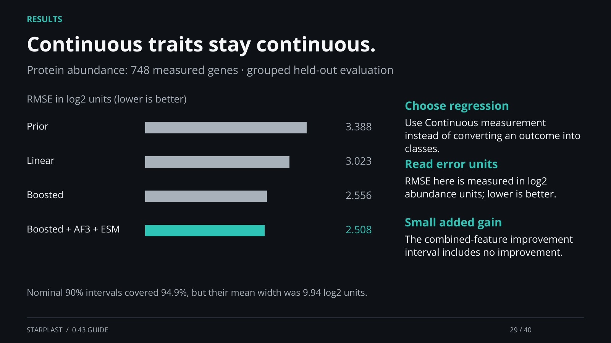

[← Back](28.md) · 29 / 40 · [Next →](30.md)

## Continuous traits stay continuous.

Protein abundance: 748 measured genes · grouped held-out evaluation

Choose regression: Use Continuous measurement instead of converting an outcome into classes.

Read error units: RMSE here is measured in log2 abundance units; lower is better.

Small added gain: The combined-feature improvement interval includes no improvement.

Nominal 90% intervals covered 94.9%, but their mean width was 9.94 log2 units.

[Supporting documentation](https://einarolafsson.github.io/starplast/benchmark-0.43.html)
