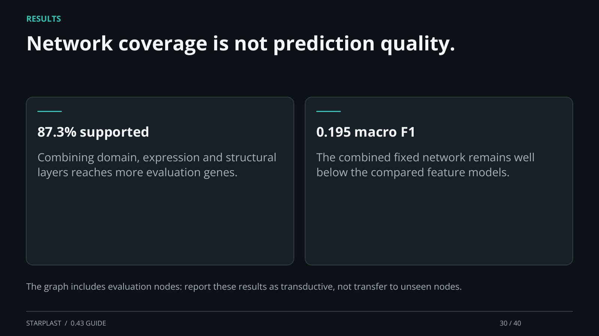

[← Back](29.md) · 30 / 40 · [Next →](31.md)

## Network coverage is not prediction quality.

87.3% supported: Combining domain, expression and structural layers reaches more evaluation genes.

0.195 macro F1: The combined fixed network remains well below the compared feature models.

The graph includes evaluation nodes: report these results as transductive, not transfer to unseen nodes.

[Supporting documentation](https://einarolafsson.github.io/starplast/benchmark-0.43.html)
