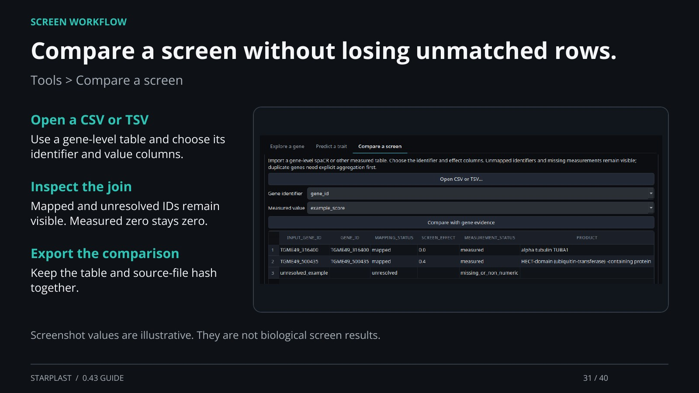

[← Back](30.md) · 31 / 40 · [Next →](32.md)

## Compare a screen without losing unmatched rows.

Tools > Compare a screen

Open a CSV or TSV: Use a gene-level table and choose its identifier and value columns.

Inspect the join: Mapped and unresolved IDs remain visible. Measured zero stays zero.

Export the comparison: Keep the table and source-file hash together.

Screenshot values are illustrative. They are not biological screen results.

[Supporting documentation](https://einarolafsson.github.io/starplast/workflows.html)
