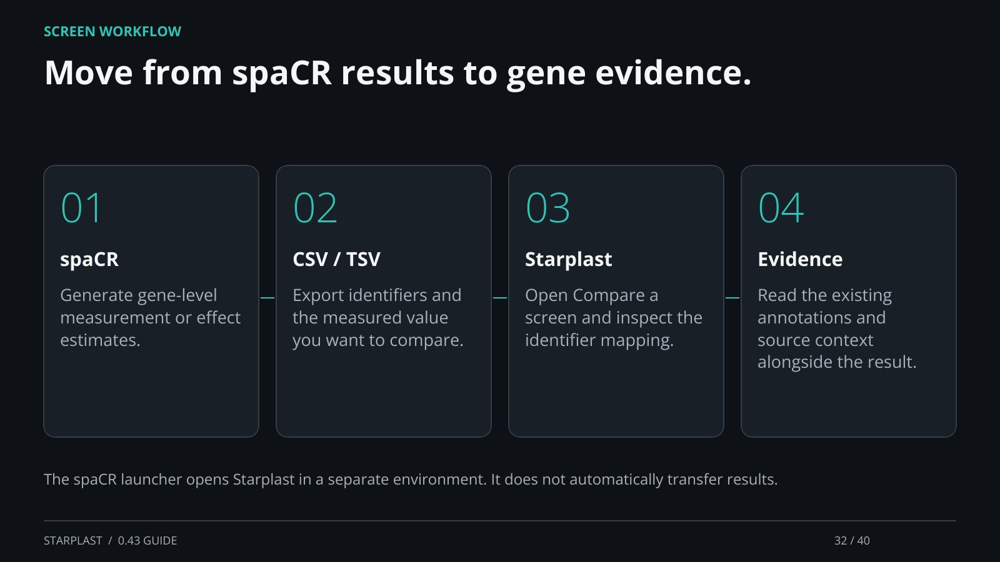

[← Back](31.md) · 32 / 40 · [Next →](33.md)

## Move from spaCR results to gene evidence.

spaCR: Generate gene-level measurement or effect estimates.

CSV / TSV: Export identifiers and the measured value you want to compare.

Starplast: Open Compare a screen and inspect the identifier mapping.

Evidence: Read the existing annotations and source context alongside the result.

The spaCR launcher opens Starplast in a separate environment. It does not automatically transfer results.

[Supporting documentation](https://einarolafsson.github.io/starplast/workflows.html)
