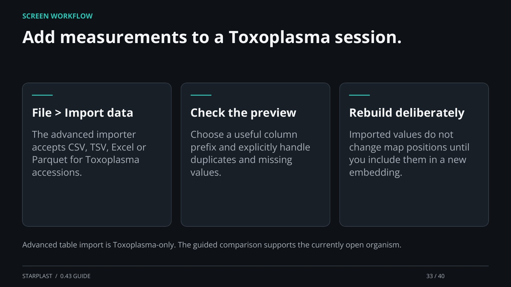

[← Back](32.md) · 33 / 40 · [Next →](34.md)

## Add measurements to a Toxoplasma session.

File > Import data: The advanced importer accepts CSV, TSV, Excel or Parquet for Toxoplasma accessions.

Check the preview: Choose a useful column prefix and explicitly handle duplicates and missing values.

Rebuild deliberately: Imported values do not change map positions until you include them in a new embedding.

Advanced table import is Toxoplasma-only. The guided comparison supports the currently open organism.

[Supporting documentation](https://einarolafsson.github.io/starplast/guide.html)
