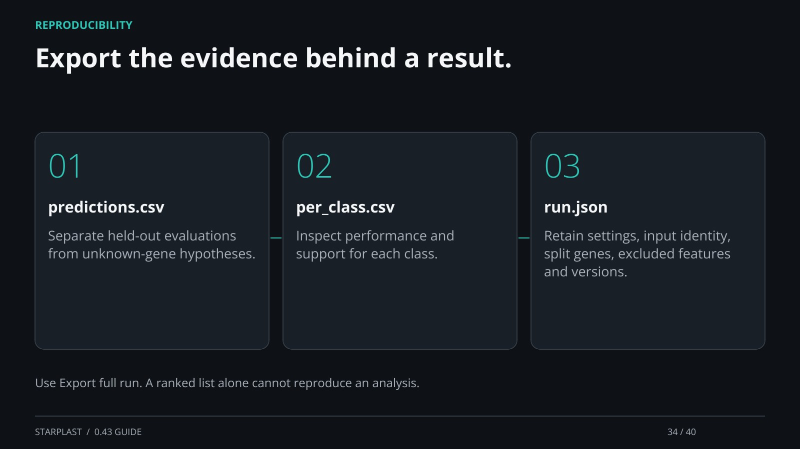

[← Back](33.md) · 34 / 40 · [Next →](35.md)

## Export the evidence behind a result.

predictions.csv: Separate held-out evaluations from unknown-gene hypotheses.

per_class.csv: Inspect performance and support for each class.

run.json: Retain settings, input identity, split genes, excluded features and versions.

Use Export full run. A ranked list alone cannot reproduce an analysis.

[Supporting documentation](https://einarolafsson.github.io/starplast/workflows.html)
