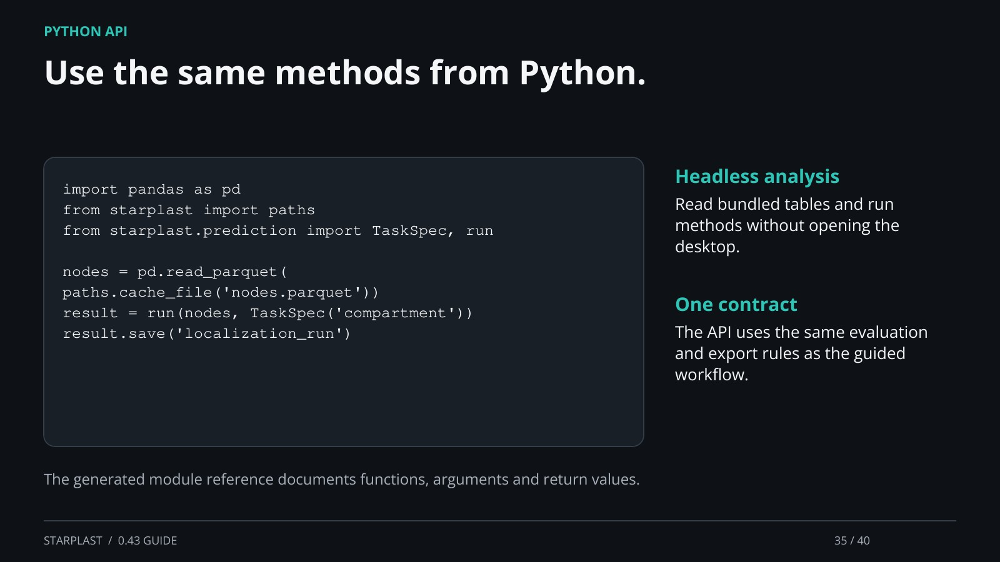

[← Back](34.md) · 35 / 40 · [Next →](36.md)

## Use the same methods from Python.

import pandas as pd
from starplast import paths
from starplast.prediction import TaskSpec, run

nodes = pd.read_parquet(
    paths.cache_file('nodes.parquet'))
result = run(nodes, TaskSpec('compartment'))
result.save('localization_run')

Headless analysis: Read bundled tables and run methods without opening the desktop.

One contract: The API uses the same evaluation and export rules as the guided workflow.

The generated module reference documents functions, arguments and return values.

[Supporting documentation](https://einarolafsson.github.io/starplast/API.html)
