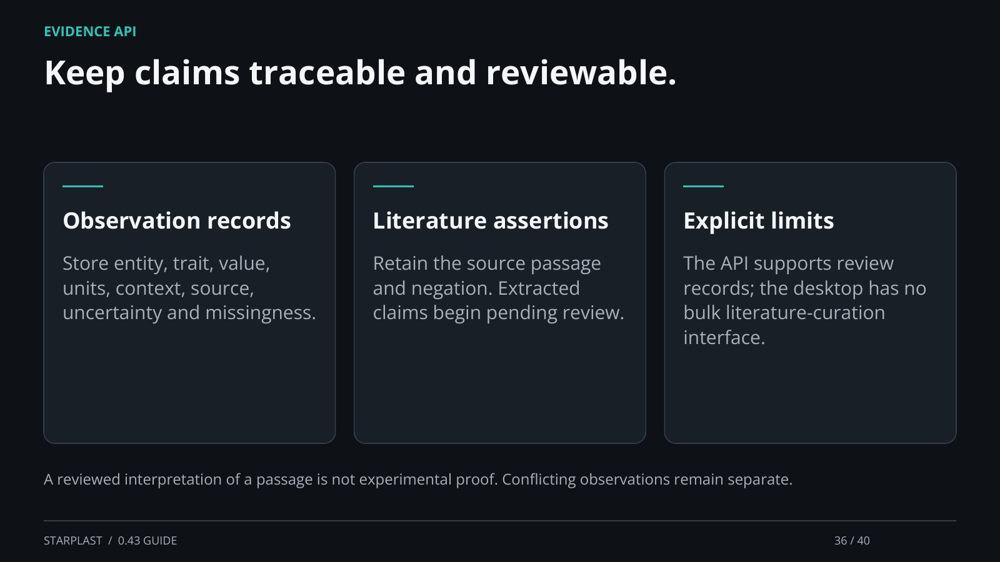

[← Back](35.md) · 36 / 40 · [Next →](37.md)

## Keep claims traceable and reviewable.

Observation records: Store entity, trait, value, units, context, source, uncertainty and missingness.

Literature assertions: Retain the source passage and negation. Extracted claims begin pending review.

Explicit limits: The API supports review records; the desktop has no bulk literature-curation interface.

A reviewed interpretation of a passage is not experimental proof. Conflicting observations remain separate.

[Supporting documentation](https://einarolafsson.github.io/starplast/workflows.html)
