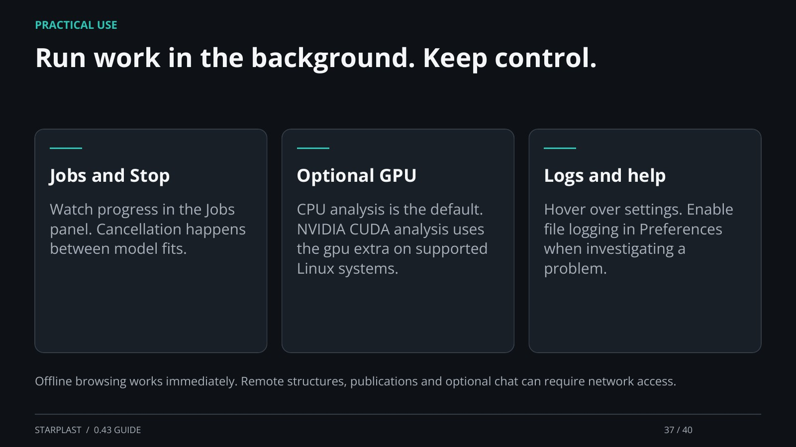

[← Back](36.md) · 37 / 40 · [Next →](38.md)

## Run work in the background. Keep control.

Jobs and Stop: Watch progress in the Jobs panel. Cancellation happens between model fits.

Optional GPU: CPU analysis is the default. NVIDIA CUDA analysis uses the gpu extra on supported Linux systems.

Logs and help: Hover over settings. Enable file logging in Preferences when investigating a problem.

Offline browsing works immediately. Remote structures, publications and optional chat can require network access.

[Supporting documentation](https://einarolafsson.github.io/starplast/guide.html)
