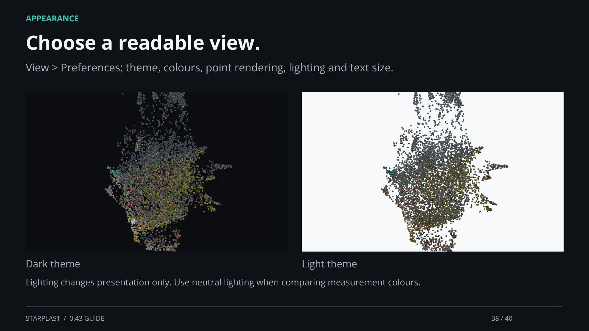

[← Back](37.md) · 38 / 40 · [Next →](39.md)

## Choose a readable view.

View > Preferences: theme, colours, point rendering, lighting and text size.

Lighting changes presentation only. Use neutral lighting when comparing measurement colours.

[Supporting documentation](https://einarolafsson.github.io/starplast/guide.html)
