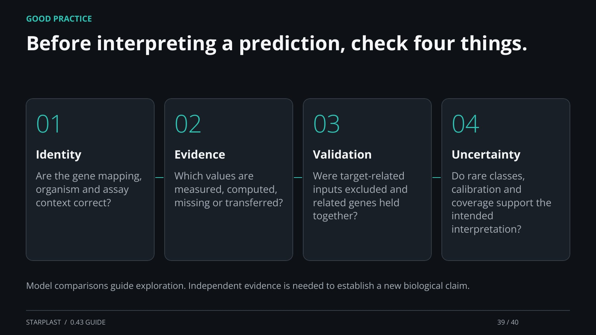

[← Back](38.md) · 39 / 40 · [Next →](40.md)

## Before interpreting a prediction, check four things.

Identity: Are the gene mapping, organism and assay context correct?

Evidence: Which values are measured, computed, missing or transferred?

Validation: Were target-related inputs excluded and related genes held together?

Uncertainty: Do rare classes, calibration and coverage support the intended interpretation?

Model comparisons guide exploration. Independent evidence is needed to establish a new biological claim.

[Supporting documentation](https://einarolafsson.github.io/starplast/benchmark-0.43.html)
