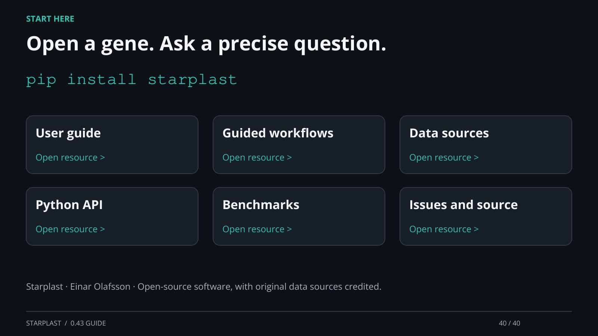

[← Back](39.md) · 40 / 40 · [Next →](01.md)

## Open a gene. Ask a precise question.

pip install starplast

User guide: https://einarolafsson.github.io/starplast/guide.html

Guided workflows: https://einarolafsson.github.io/starplast/workflows.html

Data sources: https://einarolafsson.github.io/starplast/datasets.html

Python API: https://einarolafsson.github.io/starplast/API.html

Benchmarks: https://einarolafsson.github.io/starplast/benchmark-0.43.html

Issues and source: https://github.com/EinarOlafsson/starplast

Starplast · Einar Olafsson · Open-source software, with original data sources credited.

[Supporting documentation](https://einarolafsson.github.io/starplast/index.html)
