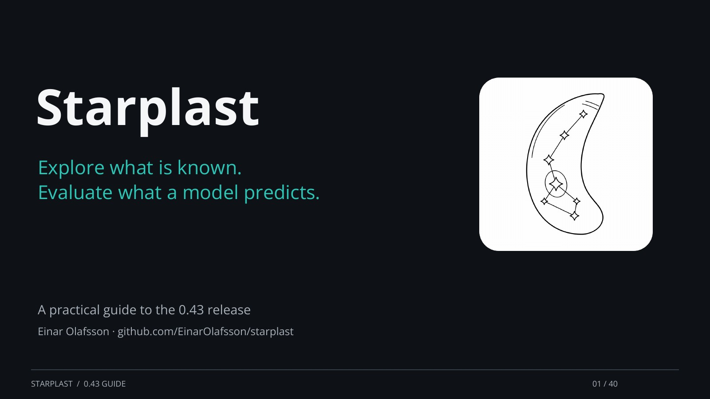

# Starplast

[](deck/)

[Open the slide viewer](deck/) · [Download PDF](deck/starplast_deck.pdf) ·
[Editable PowerPoint](deck/starplast_deck.pptx) · [Slide transcript](deck/transcript.md)

[Explore a gene, predict a trait or compare a screen](workflows.md) using the
guided workflows in the Tools menu.

Explore gene evidence and screen results in *Toxoplasma gondii* and
*Plasmodium falciparum*. Starplast combines gene maps with expression, fitness,
localization, interaction, and literature evidence.

```bash
pip install starplast
starplast
```

- [User guide](guide.md): import results, explore genes, and understand settings.
- [Python API](API.md): work with tables, embeddings, and analyses in scripts.
- [Module reference](api/starplast.html): generated signatures and docstrings.
- [Tutorials](tutorial/index.html): five task walkthroughs, each as a GUI tour and a notebook, plus one long guide to every feature.
- [Dataset catalogue](datasets.md): source records, assay types, and coverage.
- [Strategy calibration](calibration.md): how well each strategy recovers held-out knowledge, over a grid of its settings, with intervals.
- [The integrated neighbour space](graphspace.md): one graph from every layer, and the three nulls that decide whether its edges mean anything.
- [0.43 benchmark](benchmark-0.43.md): held-out model comparisons, controls and limitations.
- [Scientific roadmap](scientific-roadmap.md): inference goals, validation priorities, and proposed improvements.
- [Repository review](repository-review.md): architecture and scientific limitations.
- [Protein sequence representations](protein-sequences.md): frozen ESM features and regeneration.
- [Local AF3 structures](structures.md): index models and interpret confidence features.
- [Forty logo directions](assets/logo-collection-40/index.html): eight families, light/dark previews and downloadable SVGs.
- [Ten logo refinements](assets/logo-refinements/index.html): compare and download SVG proposals.
- [Development and releases](releases.md): build, test, and publish.

[](screenshots/map_rotation.png)

CDPK1 (`TGME49_301440`) and its five neighbours emit light. Lines show
attention-corrected literature co-mention links; colours show compartments.
This animation shows the pre-0.43 layout.
[View a still image](screenshots/map_rotation.png).
