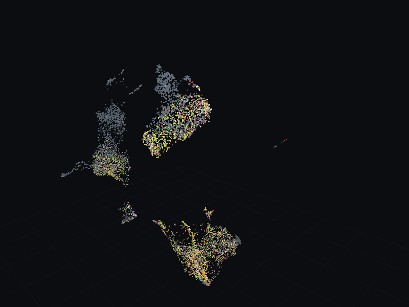

# Starplast


Explore gene evidence and screen results in *Toxoplasma gondii* and
*Plasmodium falciparum*. Starplast combines gene maps with expression, fitness,
localization, interaction, and literature evidence.

```bash
pip install starplast
starplast
```

- [User guide](guide.md): import results, explore genes, and understand settings.
- [Python API](API.md): work with tables, embeddings, and analyses in scripts.
- [Module reference](api/starplast.html): generated signatures and docstrings.
- [Dataset catalogue](datasets.md): source records, assay types, and coverage.
- [Repository review](repository-review.md): architecture and scientific limitations.
- [Development and releases](releases.md): build, test, and publish.

[](screenshots/map_rotation.png)

CDPK1 (`TGME49_301440`) and its five neighbours emit light. Lines show
attention-corrected literature co-mention links; colours show compartments.
[View a still image](screenshots/map_rotation.png).
